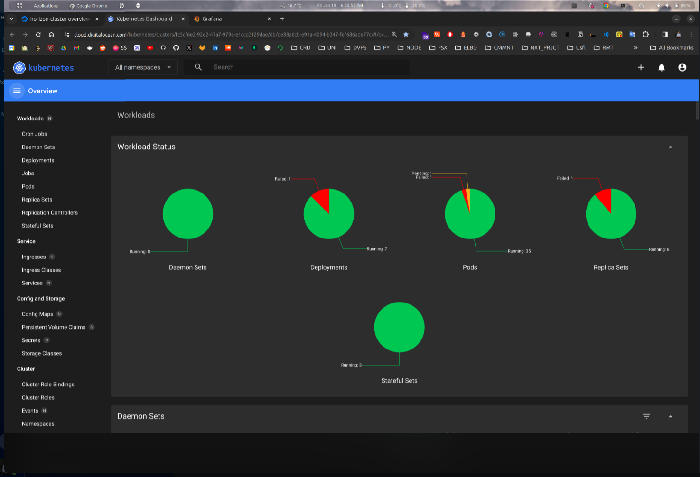
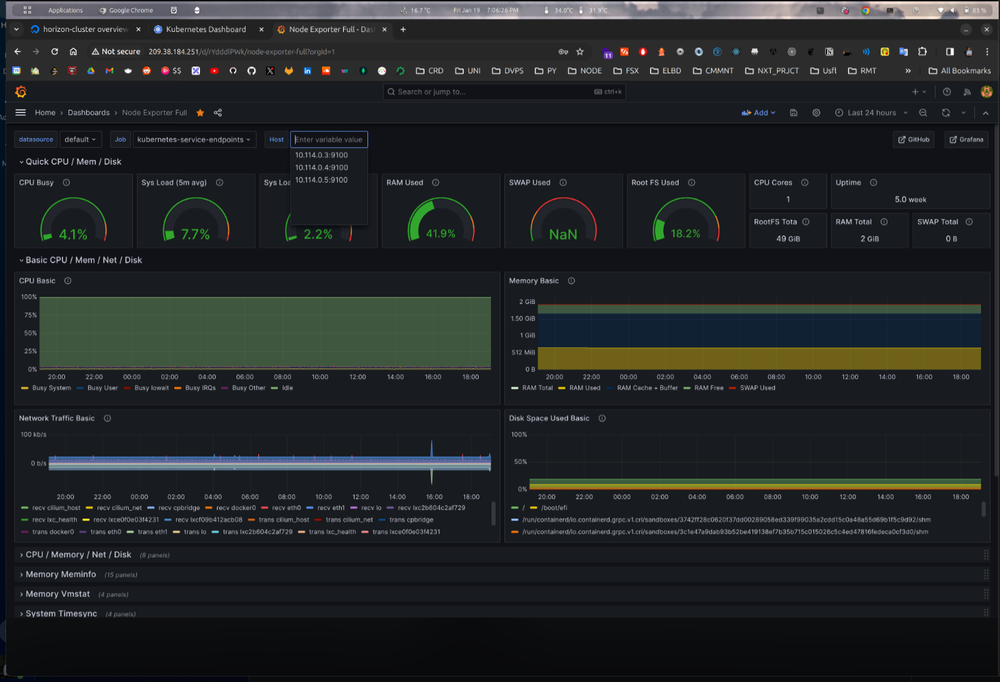
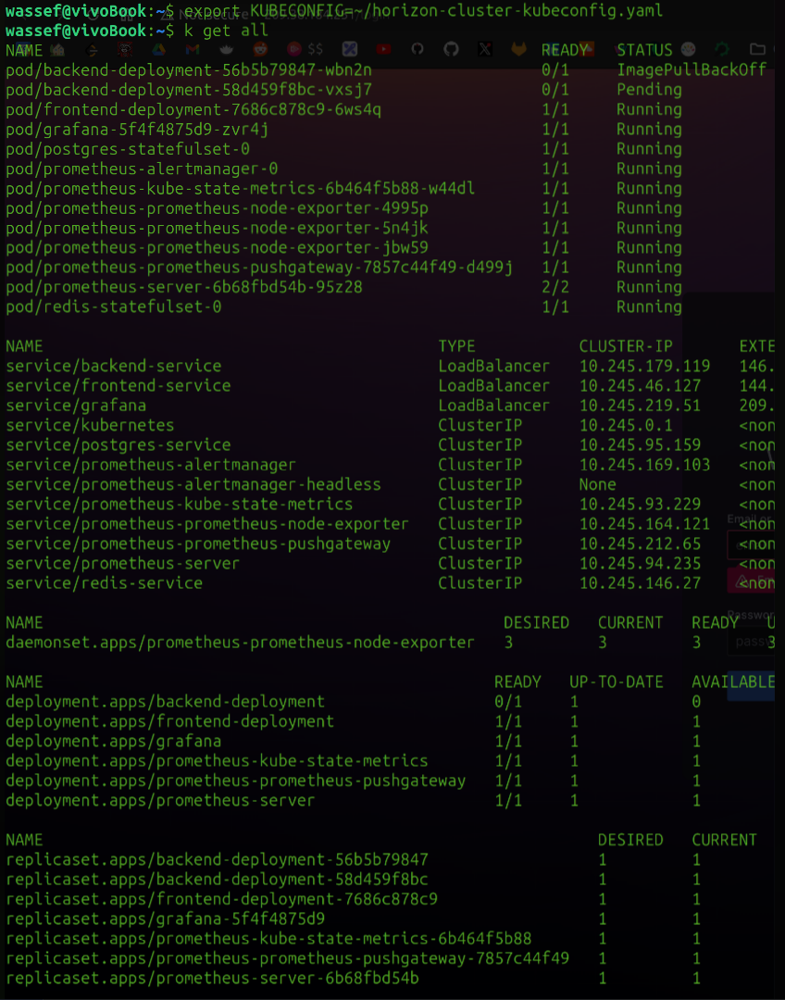

# integrated-project

[](https://github.com/ihebriahi-horizon/integrated-project/actions/workflows/back.yml)

### University project for: [Horizon School Of Digital Technologies](https://horizon-university.tn/)

An infrastructure for a dummy E-commerce store.

Deployed on a managed Kubernetes service.

### for local development

you need to create a .env file under this directory (checkout: env-example) ... then just:

```sh
mv env-example > .env
docker-compose up -d
```




